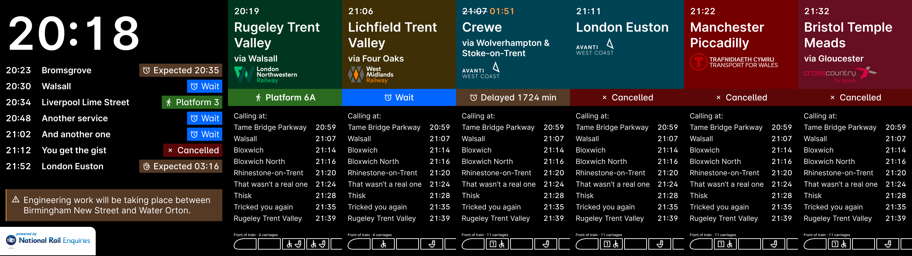
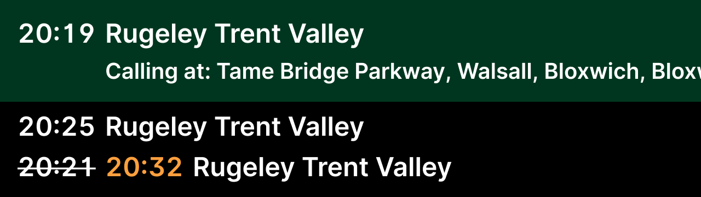
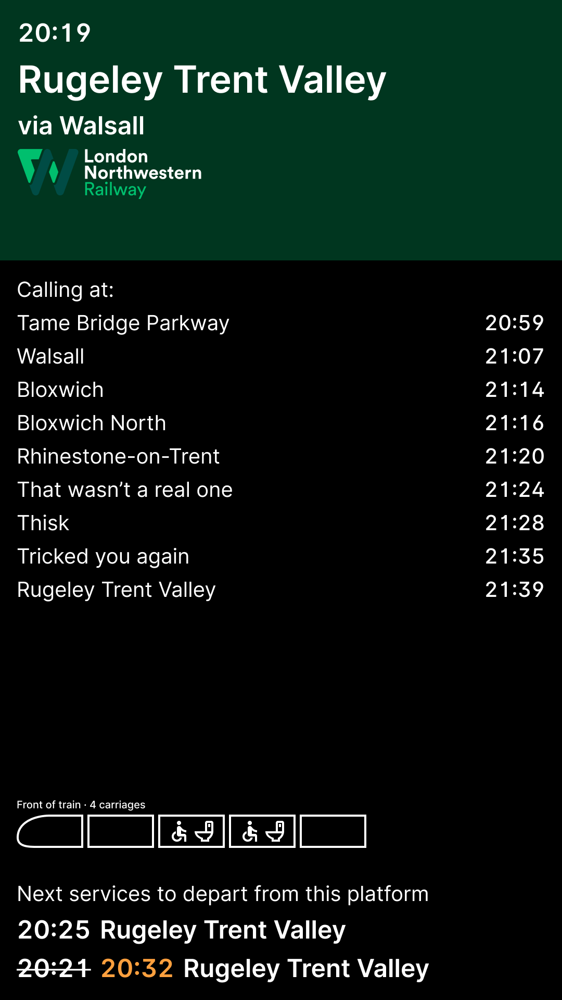

# train-departure-board

Compose Desktop powered train departure board, using the OpenLDBSVWS (yes, that's what it's called)

Sorry about the weird Git history, lol

Figma: https://www.figma.com/design/t7ylraunuuJrC88m9fxJZg/Untitled?node-id=1-2&t=FGm7jiTHHn2eumHJ-0

## Motivation
I like trains. I want to learn Compose.

## Arcade

### Hour 1 progress

### Hour 2 progress

I think the NRE logo looks horrible here but it's part of the terms of service so I must.

At platform horizontal departure board.

At platform vertical departure board.